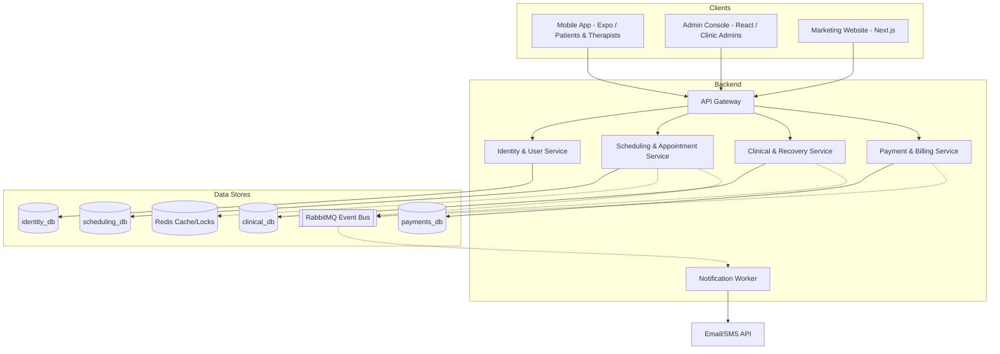

# One Medical — Physiotherapy Recovery Platform

One Medical is a comprehensive, production-grade rehabilitation and physiotherapy ecosystem. It consists of a role-based mobile application (supporting patients and therapists), a public marketing landing page, and a clinic management web console for admins, all backed by a distributed microservices backend.

This repository is organized as a monorepo containing all services, web clients, and mobile clients in one place for ease of orchestration and development.

---

## Architecture Overview

The system follows a microservices architecture with a single API Gateway routing requests to downstream, independent database-per-service microservices:



---

## Directory Structure

```text
├── apps/
│   ├── marketing-website/     # Next.js SSR Web App
│   ├── admin-console/         # Vite + React.js SPA Dashboard (Clinic Admins)
│   └── mobile-app/            # Expo (React Native) App (Patients & Therapists)
├── services/
│   ├── api-gateway/           # Central Routing, Rate Limiting & Auth Gateway
│   ├── identity-service/      # User management, OTP & Profile DB
│   ├── scheduling-service/    # Booking engine, slot generator, Redis locks
│   ├── clinical-service/      # Recovery exercises & session logger
│   ├── payment-service/       # Orders, webhook signature logic, invoices
│   └── notification-worker/   # RabbitMQ consumer for email/SMS/push notifications
├── package.json               # Monorepo Workspace configuration
└── docker-compose.yml         # Local environment setup (Mongo, Redis, RabbitMQ)
```

---

## Free-Tier Tech Stack & Setup

To ensure zero hosting and operational costs during development and initial production, the stack is configured to leverage the following free tiers:

| Service Type | Recommended Free Tier Option | Limitations / Capacity |
| :--- | :--- | :--- |
| **Database** | MongoDB Atlas (M0 Shared Cluster) | 512 MB storage |
| **Cache/Locks** | Upstash Redis | 10,000 requests/day |
| **Broker** | CloudAMQP (RabbitMQ) | 1M messages/month |
| **Emails** | Brevo (formerly Sendinblue) / Mailersend | 300 emails/day / 12,000 emails/month |
| **File Storage** | Supabase Storage | 50 GB storage, 50 GB bandwidth |
| **Hosting (Web)** | Vercel / Netlify / Cloudflare Pages | Unlimited static & serverless projects |
| **Hosting (API)** | Render / Railway / Oracle Cloud Free Tier | Free instance hours / Free compute instances |

---

## Local Development Quickstart

### Prerequisites
- Node.js 20 LTS or later
- Docker & Docker Compose
- Expo Go App (optional, for testing the mobile app on a physical device)

### 1. Clone & Install Dependencies
From the repository root:
```bash
npm install
```

### 2. Boot Local Infrastructure (Databases, Cache, Queue)
Use Docker Compose to run local MongoDB instances, Redis cache, and RabbitMQ:
```bash
docker-compose up -d
```

### 3. Configure Environment Variables
Create `.env` files in each service directory according to their `.env.example` templates (these will be generated during the execution phases).

### 5. Start Development Servers
Run the complete application suite locally using hot-reload:
```bash
npm run dev
```

---

## Production Security & Resiliency Features

1. **Security**:
   - Short-lived JWT Access Tokens (15 min) + Rotating Refresh Tokens (30 days) with automatic reuse-theft detection.
   - Centralized RBAC checks at the API Gateway.
   - Parameterized queries to prevent SQL/NoSQL Injection (Mongoose ODM).
   - Server-side validation (Zod) on all ingress endpoints.
2. **Double Booking Prevention**:
   - Redis distributed locking (`Redlock` pattern) to handle high concurrency slot-reservation requests.
3. **Idempotent Webhooks**:
   - Verifies cryptographically signed webhooks from payment gateways with automatic deduplication.
