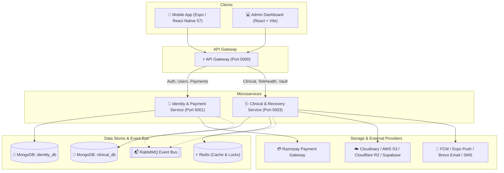

# OneMedical — Comprehensive Physiotherapy & Clinical Recovery Ecosystem

OneMedical is a production-grade, distributed clinical recovery and physiotherapy ecosystem. It empowers patients with guided rehabilitation programs, real-time telehealth consultations, and exercise tracking while giving clinicians and administrators powerful tools for schedule management, telehealth sessions, medical records vaulting, and automated multi-channel patient notifications.

---

## Architecture Overview

The backend uses a distributed microservices pattern fronted by a reverse-proxy API Gateway with JWT verification, rate-limiting, and resilient routing:



---

## Monorepo Project Structure

```text
OneMedical/
├── Client/                             # Cross-platform Mobile Application (Expo / React Native)
│   ├── src/
│   │   ├── features/
│   │   │   ├── auth/                  # Authentication, OTP, Complete Profile, Patient/Therapist Overviews
│   │   │   ├── clinical/              # Recovery Programs, Daily Exercises, Pain Tracker, Vault, Telehealth
│   │   │   └── telehealth/            # WebRTC video consultation & real-time chat
│   │   ├── navigation/                # Bottom Tabs & Native Stack Navigation
│   │   └── shared/                    # Redux Toolkit store, offline sync engine & resilient API client
│   ├── app.json                       # Expo configuration & deep linking
│   ├── eas.json                       # EAS Build profile for Standalone Android APK
│   └── package.json
│
├── Admin/                              # Hospital / Clinic Administration Portal
│   ├── src/                           # Vite + React.js web dashboard
│   └── package.json
│
├── Server/                             # Distributed Backend Microservices
│   ├── gateway/                       # Central Reverse Proxy & Auth Gateway (Port 5000)
│   ├── identity-service/              # Auth, RBAC, User Profiles, Razorpay Billing (Port 5001)
│   ├── clinical-service/              # Consultations, Exercises, Records Vault, Notifications (Port 5003)
│   └── docker-compose.yml             # Local infrastructure (MongoDB, Redis, RabbitMQ)
│
├── render.yaml                        # Infrastructure-as-Code for Render Cloud Deployment
├── package.json                       # Root orchestration & scripts
└── README.md
```

---

## Core Features & Modules

### 1. 📱 Mobile Client (`Client/`)
- **Modern UI/UX**: Custom glassmorphism styling (`expo-glass-effect`), smooth gradient cards, Lucide icons, dynamic themes, and haptic feedback.
- **Role-Based Workflows**: Dedicated views and navigation flows for **Patients** and **Therapists**.
- **Clinical Recovery Engine**:
  - Daily assigned routine & session overview (`TodaysSessionScreen`).
  - Active interactive exercise timer with voice countdown & rest intervals (`ExerciseTimerActiveScreen`).
  - Interactive visual pain assessment logger & VAS pain scale tracking (`PainAssessmentScreen`).
  - Recovery progress analytics with adherence statistics & milestones (`RecoveryProgressAnalyticsScreen`).
- **Medical Records Vault**: Secure encrypted storage viewer for lab reports, clinical notes, and X-ray/MRI scans (`MedicalRecordsVaultScreen`).
- **Telehealth & Real-Time Chat**: Live WebRTC-enabled consultations and instant messaging (`TelehealthConsultationScreen`).
- **Resilient Offline Mode**: Local queueing of write mutations via `offlineSyncService` with auto-sync upon network reconnection.

### 2. ⚡ API Gateway (`Server/gateway`)
- Dynamic service routing and proxying to `identity-service` and `clinical-service`.
- Centralized JWT verification and role extraction.
- Strict CORS configuration and standardized JSON error responses.

### 3. 🔐 Identity & Billing Service (`Server/identity-service`)
- **Authentication**: Passwordless OTP, email/password login, JWT access token rotation, and refresh token theft prevention.
- **Profiles**: Dedicated Schemas for `PatientProfile`, `TherapistProfile`, and `User`.
- **Payment & Billing**: Integrated **Razorpay** checkout, automatic invoice generation, and idempotent cryptographic webhook verification.

### 4. 🩺 Clinical & Recovery Service (`Server/clinical-service`)
- **Treatment Plans**: CRUD for physiotherapy exercises, treatment programs, and clinical consultations.
- **Multi-Storage Vault**: Pluggable storage adapter supporting Cloudinary, AWS S3, Cloudflare R2, Supabase Storage, and local fallback.
- **Multi-Channel Notification Worker**: Asynchronous RabbitMQ worker delivering real-time alerts via Expo Push, Firebase Cloud Messaging (FCM), Brevo (Email), and SMS.

---

## Quickstart & Local Setup

### Prerequisites
- **Node.js**: >= 20.11.0
- **Docker & Docker Compose** (for local databases and message brokers)
- **Expo CLI / EAS CLI** (for mobile development and APK builds)

### 1. Clone & Install Dependencies
```bash
# Clone the repository
git clone <YOUR_REPO_URL>
cd OneMedical

# Install root & workspace dependencies
npm install
```

### 2. Start Local Databases (Docker)
```bash
cd Server
docker-compose up -d
```

### 3. Configure Environment Variables
Copy `.env.example` in each service to `.env` and fill in your keys:
- `Server/gateway/.env`
- `Server/identity-service/.env`
- `Server/clinical-service/.env`

### 4. Start the Microservices
```bash
# In separate terminals or using root script:
cd Server/identity-service && npm run dev
cd Server/clinical-service && npm run dev
cd Server/gateway && npm run dev
```

### 5. Launch the Mobile Client
```bash
cd Client
npx expo start
```

---

## 🚀 Deployment (Render Blueprint)

The repository includes a ready-to-use [`render.yaml`](render.yaml) blueprint that deploys all 3 backend services simultaneously:

1. Push your repository to **GitHub**.
2. Go to [Render Dashboard](https://dashboard.render.com/) → Click **New +** → **Blueprint**.
3. Select your repository. Render will automatically provision:
   - `onemedical-gateway`
   - `onemedical-identity`
   - `onemedical-clinical`
4. Set your `MONGO_URI`, `RABBITMQ_URL`, and third-party API keys in Render's environment settings.

---

## 📦 Building the Android APK

### Option 1: EAS Cloud Build (Recommended)
`Client/eas.json` is pre-configured with the `preview` APK profile:
```bash
cd Client
# Log into your Expo account
npx eas-cli login

# Start Android APK build
npx eas-cli build -p android --profile preview
```
Once the build completes on EAS servers, a download link and QR code for the `.apk` file will be provided.

### Option 2: Local Android Build
```bash
cd Client/android
./gradlew assembleRelease
```
The output standalone APK will be generated at:
`Client/android/app/build/outputs/apk/release/app-release.apk`

---

## 🛡️ Security & Resiliency Highlights

- **JWT + Refresh Token Rotation**: Automatic token expiration with secure refresh handling.
- **Idempotent Webhooks**: Protected against replay attacks with cryptographic signature validation.
- **Resilient Offline Architecture**: Automatic caching and background synchronization for uninterrupted clinical usage in poor network environments.
- **Configurable Multi-Storage**: Secure handling of sensitive medical artifacts and patient records.

---

## License

This project is licensed under the MIT License.
