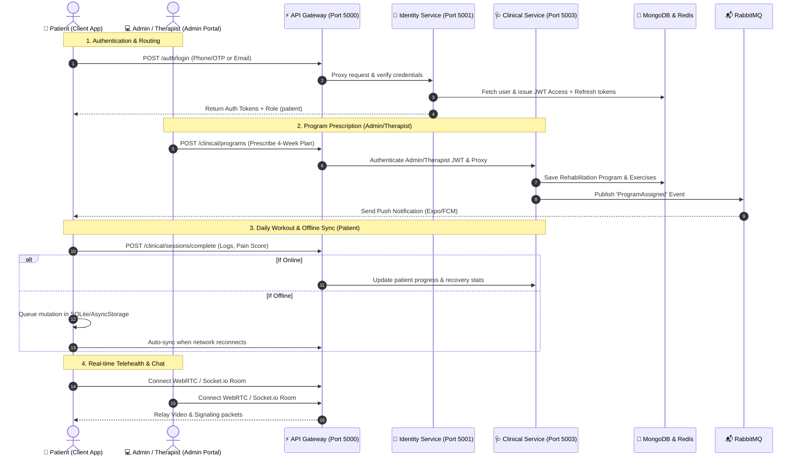
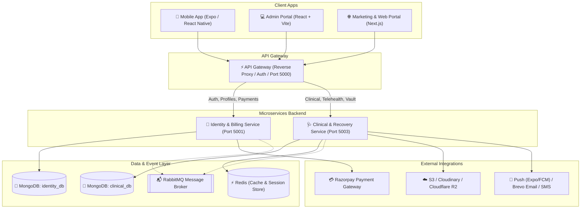

---

# 🏗️ OneMedical: System Working & Interaction Model

---

## 1. ⚙️ How the Backend Works (`Server/`)

The backend is built as an **event-driven microservices architecture** coordinated by a central gateway:

### A. API Gateway (`Server/gateway` — Port 5000)
* **Single Public Gateway**: Acts as the reverse proxy for all incoming mobile and web admin requests.
* **Security & Token Validation**: Inspects incoming JWT bearer tokens, attaches user ID and role headers (`x-user-id`, `x-user-role`), and blocks unauthorized calls before they hit downstream services.
* **Socket.io Signaling Server**: Manages real-time WebRTC room signaling and instant messaging between patients and therapists.
* **Resilience & Sanitization**: Provides automatic request ID tracing, NoSQL injection sanitization, rate-limiting, and CORS controls.

### B. Identity & Payment Microservice (`Server/identity-service` — Port 5001)
* **Authentication**: Supports passwordless OTP, standard email/password authentication, and secure JWT rotation (short-lived access tokens + refresh token reuse detection).
* **Role-Based Access Control (RBAC)**: Manages permissions for `patient`, `therapist`, `clinic_admin`, and `super_admin`.
* **Billing & Razorpay Integration**: Creates payment orders, generates invoice records, and verifies webhook signatures cryptographically to prevent payment forgery.

### C. Clinical & Recovery Microservice (`Server/clinical-service` — Port 5003)
* **Rehabilitation Engine**: Manages exercise libraries, assigned recovery programs, daily session routines, and VAS (Visual Analogue Scale) pain score logs.
* **Pluggable Medical Records Vault**: Uploads and securely encrypts MRI scans, X-rays, and clinical notes to AWS S3, Cloudinary, Cloudflare R2, or Supabase.
* **Asynchronous Notification Worker**: Listens to RabbitMQ message queues to dispatch background push notifications (Expo Push, FCM), transaction emails (Brevo), and SMS without blocking API response times.

---

## 2. 📱 How the Mobile Client Works (`Client/`)

Built with **React Native / Expo** and **Redux Toolkit**, it provides a role-tailored native experience for patients and therapists:

1. **Patient Recovery Routine**:
   * Fetches active recovery programs for the day (`TodaysSessionScreen`).
   * **Active Workout Timer**: Guides patients with voice countdowns, rep counts, and timed rest intervals (`ExerciseTimerActiveScreen`).
   * **Pain Assessment**: Patients interactively rate pain severity, location, and triggers (`PainAssessmentScreen`).
2. **Medical Vault & Diagnostics**:
   * Encrypted viewer for clinical history, lab reports, and doctor prescriptions.
3. **Telehealth Consultation**:
   * In-app WebRTC video consultations and live chat directly with the assigned physiotherapist.
4. **Resilient Offline-First Engine (`resilientFetch`)**:
   * Uses [apiClient.js](file:///c:/Users/uditp/Desktop/OneMedical/Client/src/shared/apiClient.js) and `offlineSyncService`. If the patient is doing exercises in an area without network reception, completed sets and pain logs are cached locally and synchronized seamlessly once network connectivity resumes.

---

## 3. 💻 How the Admin Web Portal Works (`Admin/`)

Built with **React, Vite, and Redux Toolkit**, it serves as the hospital/clinic command center:

1. **Role Protection & Permission Guard**:
   * Enforces role checks (`admin`, `clinic_admin`, `therapist`, `doctor`) via [PermissionGuard.jsx](file:///c:/Users/uditp/Desktop/OneMedical/Admin/src/components/PermissionGuard.jsx).
2. **Clinical Management**:
   * **Patients Directory**: Search patients, view recovery adherence charts, medical history, and clinical notes.
   * **Therapist Scheduling**: Assign therapists to patients, manage consultation slots, and monitor therapist workloads.
   * **Program & Exercise Builder**: Create new physical therapy exercises with video URLs, instructions, and assemble multi-week recovery programs.
3. **Telehealth & Live Chat Room**:
   * Therapists can join live video rooms (`AdminTelehealthRoom`) and chat with active patients in real time.
4. **Billing & Operations**:
   * Track payments, verify invoices, handle appointment rescheduling, and monitor clinic revenue analytics.

---

## 4. 🔄 End-to-End Real-World Scenario

Here is how the three tiers work together during a normal clinical cycle:

| Step | Action | Client (Mobile) | Admin Portal | Backend Microservices |
| :--- | :--- | :--- | :--- | :--- |
| **1. Booking** | Patient books a consultation | Selects slot, pays via Razorpay | Sees slot booked on calendar | Gateway routes payment to Identity Svc; appointment created |
| **2. Consultation** | Telehealth Video Session | Connects to video room | Therapist joins video room | Gateway Socket.io handles WebRTC audio/video signaling |
| **3. Prescription** | Plan Creation | Receives push notification | Therapist builds 30-day program | Clinical Svc saves program & pushes event to RabbitMQ |
| **4. Exercise** | Daily Routine Execution | Guided audio timer & pain rating | Monitors compliance graph | Clinical Svc updates adherence stats in MongoDB & Redis |
| **5. Records** | Lab Report Upload | Views encrypted report in Vault | Admin/Therapist uploads MRI/X-Ray | Uploaded to S3/Cloudinary via Clinical Storage Vault |

---

## 5. Summary Highlights to Present to Your Manager

1. **Decoupled & Scalable**: Frontends (Mobile & Admin) communicate through a single secure API Gateway with domain-specific microservices.
2. **Fault Tolerant**: Asynchronous tasks (emails, notifications) are offloaded to RabbitMQ; offline patient data syncs reliably without data loss.
3. **Enterprise Security**: JWT token rotation, cryptographic payment webhooks, NoSQL sanitization, and strict Role-Based Access Control.
---

# 🏥 OneMedical — Project Overview & Architecture Guide

## 1. Executive Summary (The 1-Minute Pitch)
> **"OneMedical is a production-grade, distributed digital healthcare and clinical recovery ecosystem designed specifically for physiotherapy and rehabilitation."**

It seamlessly connects three key stakeholders:
1. **Patients** (via Mobile App): Receive personalized daily exercise routines, log visual pain scores, attend live telehealth consultations, and store encrypted medical records.
2. **Therapists / Clinicians** (via Mobile & Admin Portals): Prescribe recovery programs, track patient adherence/milestones, conduct video consultations, and review diagnostics.
3. **Hospital Administrators** (via Web Dashboard): Manage clinical staff, appointments, billing/invoices, exercise libraries, and operational analytics.

---

## 2. High-Level Architecture & Ecosystem

The project is architected as a **Monorepo** with a **Distributed Microservices** backend and multiple client frontends:

---

## 3. How the Core Modules Work

### A. Clients & Applications
* [Client/](file:///c:/Users/uditp/Desktop/OneMedical/Client) — **Cross-Platform Mobile App (Expo / React Native)**
  * **Role-Based Experience**: Tailored UX for both patients and therapists.
  * **Active Recovery Engine**: Interactive exercise timers with audio cues, rep tracking, and rest intervals.
  * **Pain Tracking & Analytics**: Visual VAS (Visual Analogue Scale) pain assessments and recovery milestone charts.
  * **Encrypted Medical Vault**: View lab reports, MRI scans, and clinical notes.
  * **Telehealth & Real-Time Chat**: Live WebRTC video sessions and instant chat.
  * **Offline-First Sync**: Mutations are queued locally if the user is offline and automatically synced once connectivity is restored.

* [Admin/](file:///c:/Users/uditp/Desktop/OneMedical/Admin) — **Hospital Admin Dashboard (React + Vite)**
  * Centralized management for clinic admins: user management, therapist assignments, exercise libraries, appointment schedules, payment reconciliation, and analytics.

* [landing/](file:///c:/Users/uditp/Desktop/OneMedical/landing) — **Public Web Portal (Next.js / TypeScript)**
  * Patient onboarding, service discovery, and public marketing interface.

---

### B. Distributed Microservices Backend
* [Server/gateway/](file:///c:/Users/uditp/Desktop/OneMedical/Server/gateway) — **Central API Gateway (Port 5000)**
  * Single entry point for all frontend traffic.
  * Centralizes **JWT token validation**, role extraction (RBAC), CORS policies, and rate-limiting.
  * Dynamically proxies requests downstream to the appropriate microservice.

* [Server/identity-service/](file:///c:/Users/uditp/Desktop/OneMedical/Server/identity-service) — **Identity & Payments (Port 5001)**
  * **Auth & Security**: Passwordless OTP, email/password login, JWT access & refresh token rotation with reuse detection.
  * **Profiles**: Dedicated data models for `Patients`, `Therapists`, and `Admins`.
  * **Billing**: Razorpay payment integration, automatic invoicing, and cryptographic webhook verification against replay attacks.

* [Server/clinical-service/](file:///c:/Users/uditp/Desktop/OneMedical/Server/clinical-service) — **Clinical & Recovery (Port 5003)**
  * **Treatment Plans**: Management of exercises, customized recovery routines, and clinical consultations.
  * **Multi-Cloud Vault**: Pluggable storage adapter supporting AWS S3, Cloudinary, Cloudflare R2, Supabase, and local storage.
  * **Asynchronous Notifications**: RabbitMQ event consumer delivering multi-channel alerts (Expo Push, FCM, Brevo Email, and SMS).

---

## 4. End-to-End User Flow (Example)

1. **Onboarding & Consultation**:
   * Patient registers via mobile app (OTP/Email).
   * Patient books an appointment; payment is securely captured via Razorpay.
   * Telehealth consultation takes place over WebRTC.
2. **Prescription & Program Setup**:
   * Therapist assigns a tailored multi-week recovery plan with specific exercises from the library.
3. **Daily Routine & Adherence**:
   * Patient receives automated push/SMS reminders via RabbitMQ.
   * Patient completes exercises using the guided timer and logs pain levels.
   * If the patient loses internet connection, the app queues the logs and syncs automatically when back online.
4. **Monitoring & Analytics**:
   * Therapist and Clinic Admins monitor recovery progress, adherence rate, and clinical reports in real time.

---

## 5. Key Engineering Highlights to Tell Your Manager

| Capability | Implementation Detail | Why it Matters to the Business |
| :--- | :--- | :--- |
| **Microservices Architecture** | API Gateway + Domain-isolated Services (Identity & Clinical) | Independent scaling, fault isolation, and modular team development. |
| **Enterprise Security** | JWT + Refresh Token Rotation & Role-Based Access Control (RBAC) | Protects sensitive clinical and patient identity data. |
| **Event-Driven Messaging** | RabbitMQ message broker | Heavy tasks (emails, push alerts, webhooks) run in background without blocking APIs. |
| **Offline Resilience** | Local Redux/Storage queue + sync engine | Doctors and patients never lose exercise/clinical data in spotty connectivity. |
| **Multi-Cloud Medical Vault** | Pluggable adapters (S3, Cloudflare R2, Cloudinary) | Flexibility to adapt to compliance, cost, and hospital data residency requirements. |
| **Deployment Ready** | Docker Compose + [render.yaml](file:///c:/Users/uditp/Desktop/OneMedical/render.yaml) + EAS Cloud builds | Zero-friction local startup and one-click cloud deployment. |

---

